# PIC32CXBZ2_WBZ45x ORIENTATION DETECTION USING TENSORFLOW LITE


> "IoT Made Easy!" 

Devices: **| PIC32CXBZ2 | WBZ45x |**<br>
Features: **| BLE | TensorFlow Lite | Machine Learning |**


## ⚠ Disclaimer

<p><span style="color:red"><b>
THE SOFTWARE ARE PROVIDED "AS IS" AND GIVE A PATH FOR SELF-SUPPORT AND SELF-MAINTENANCE. This repository contains example code intended to help accelerate client product development. </br>

For additional Microchip repos, see: <a href="https://github.com/Microchip-MPLAB-Harmony" target="_blank">https://github.com/Microchip-MPLAB-Harmony</a>

Checkout the <a href="https://microchipsupport.force.com/s/" target="_blank">Technical support portal</a> to access our knowledge base, community forums or submit support ticket requests.
</span></p></b>

## Contents

1. [Introduction](#step1)
1. [Bill of materials](#step2)
1. [Hardware Setup](#step3)
1. [Software Setup](#step4)
1. [Harmony MCC Configuration](#step5)
1. [Data Collection using MPLAB Data Visualizer](#step6)
1. [Building an Artificial Neural Network (ANN) Model with TensorFlow](#step7)
1. [Board Programming](#step8)
1. [Run the demo](#step9)

## 1. Introduction<a name="step1">

This application demonstrates how to create a simple Machine Learning application on a PIC32CX-BZ2 / WBZ451 device with TensorFlow Lite.
The application uses a pretrained TensorFlow model to classify the orientation of the WBZ451 Curiosity board and transmit the outcomes to a MBD App.

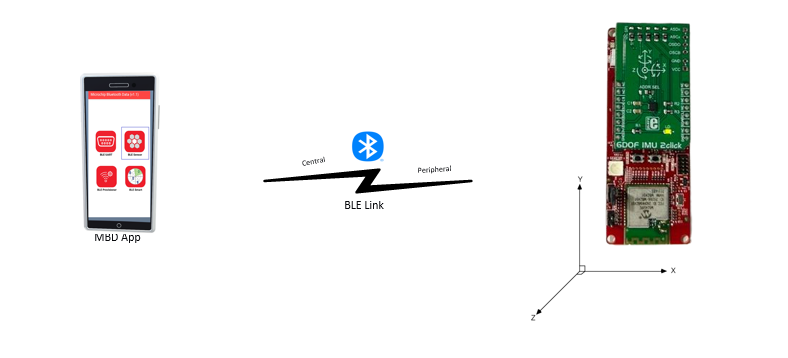

In this application, the BMI160 6DOF IMU sensor is used to obtain x, y, and z accelerometer values. These values are then fed as inputs to TensorFlow Lite, which utilizes an Artificial Neural Network (ANN) model trained to classify six different orientations: Horizontal Up, Horizontal Down, Vertical Up, Vertical Down, Side Front, and Side Back.
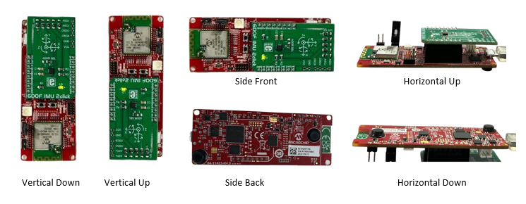

To create MPLAB project with TensorFlow Lite, The TFLite Micro component available in MCC Harmony is used. 
TensorFlow Lite is a framework that enables machine learning applications to run on resource-constrained devices, such as IoT sensors, and embedded systems.
TensorFlow Lite allows users to deploy their trained models on these devices, and perform inference tasks with low latency.

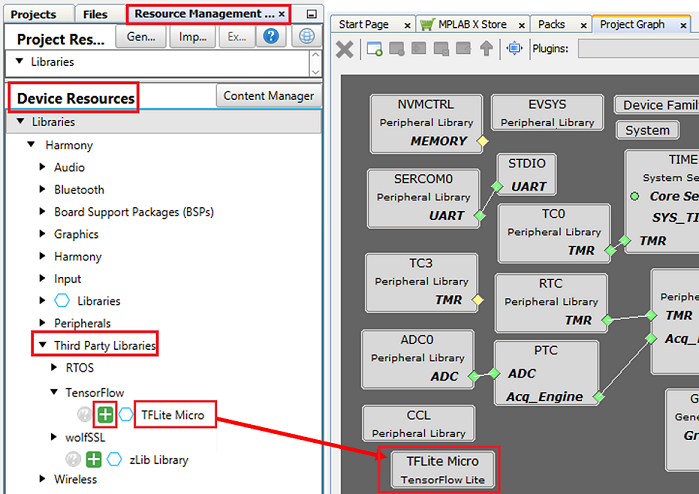

MPLAB Data Visualizer is utilized to collect the dataset required for training the machine learning model. The intuitive interface of MPLAB Data Visualizer simplifies the process of visualizing sensor data and enables users to highlight and mark the relevant data segments. These identified sections can then be saved in the CSV (Comma-Separated Values) format, which is subsequently used as input for training the model using TensorFlow.
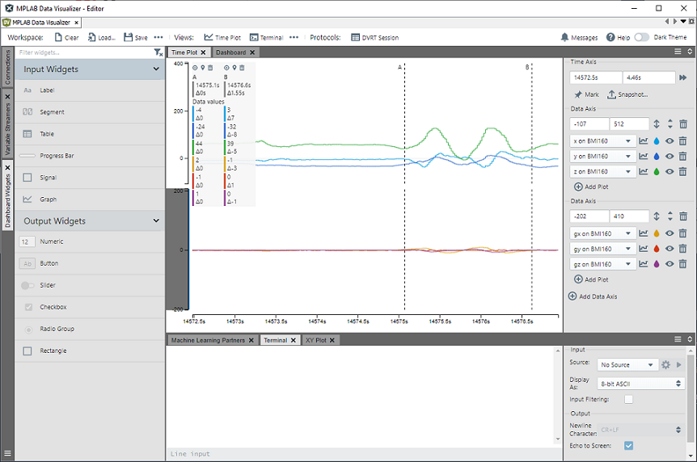

## 2. Bill of materials<a name="step2">

| TOOLS | QUANTITY |
| :- | :- |
| [PIC32CX-BZ2 and WBZ451 Curiosity Development Board](https://www.microchip.com/en-us/development-tool/EV96B94A) | 1 |
| [6DOF-IMU-2-Click](https://www.mikroe.com/6dof-imu-2-click) | 1 |

## 3. Hardware Setup<a name="step3">

- Connect the [6DOF-IMU-2-Click](https://www.mikroe.com/6dof-imu-2-click) board with the WBZ451 Curiosity board using the connections described in the following table.
 The 6DOF-IMU-2-Click board can be connected to the WBZ451 Curiosity board by inserting it directly into the Mikroe header. The specific connections can be found in the provided table.

|WBZ451|6DOF-IMU-2-Click|Description |WBZ451|6DOF-IMU-2-Click|Description|
| :- | :- | :- | :- |:- | :- |
|AN|NC|NC|PWM|NC|NC|
|RST|NC|NC|INT|INT|EXT0|
|CS|NC|NC|RX|NC|NC|
|SCK|NC|NC|TX|NC|NC|
|MISO|NC|NC|SCL|SCL|I2C Clock|
|MOSI|NC|NC|SDA|SCL|I2C Data|
|3.3V|(3.3V)|POWER SUPPLY|5V|NC|NC|
|GND|8(GND)|GROUND|GND|9(GND)|GROUND|

## 4. Software Setup<a name="step4">

- [MPLAB X IDE ](https://www.microchip.com/en-us/tools-resources/develop/mplab-x-ide#tabs)

    - Version: 6.05
	- XC32 Compiler v4.10
	- MPLAB® Code Configurator v5.3.0
	- PIC32CX-BZ_DFP v1.0.107
	- MCC Harmony
	  - csp version: v3.16.0
	  - core version: v3.12.0
	  - CMSIS-FreeRTOS: v10.5.1
	  - dev_packs: v3.16.0
	  - wolfssl version: v4.7.0-stable
	  - crypto version: v3.7.6
	  - wireless_pic32cxbz_wbz: v1.1.0
	  - wireless_system_pic32cxbz_wbz: v1.2.0
	  - wireless_ble: v1.0.0
	  - tflite-micro: v1.0.0
	  - tflite-micro-apps: v1.0.2

- [MPLAB Data Visualizer](https://www.microchip.com/en-us/tools-resources/debug/mplab-data-visualizer)

- [MPLAB X IPE v6.05](https://microchipdeveloper.com/ipe:installation)

- [Microchip Bluetooth Data (MBD app)](https://play.google.com/store/apps/details?id=com.microchip.bluetooth.data&hl=en&gl=US)

## 5. Harmony MCC Configuration<a name="step5">

### Creating MCC-Harmony Project for WBZ451 Curiosity Board with BMI160 driver and TensorFlow Lite.


**Step 1** - Connect the WBZ451 CURIOSITY BOARD to the device/system using a micro-USB cable.

**Step 2** - Create a [new MCC Harmony project](https://github.com/MicrochipTech/EA71C53A/blob/master/H3/wireless_apps_pic32cxbz2_wbz45/apps/docs/creating_new_mplabx_harmony_project.md#creating-a-new-mcc-harmony-project).

**Step 3** - The "MCC - Harmony Project Graph" below depicts the harmony components utilized in this project.

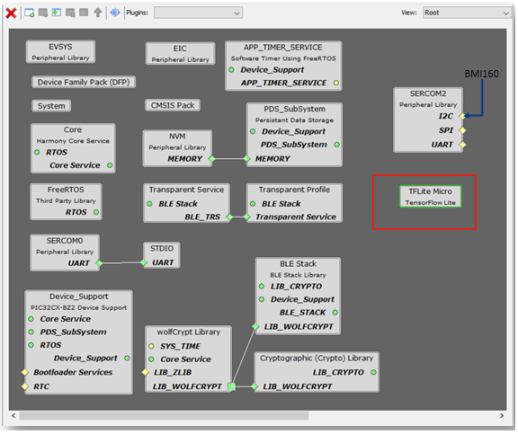

-  In Device Resources, go to Harmony->wireless->drivers->BLE->Profiles and select Transparent Profile, then add to the project. Select "Yes" to accept dependencies.

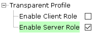

- Connect Transparent Profile to the Transparent Service as shown below.\
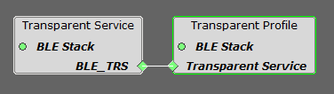

**Step 5** - In Device Resources, go to Harmony->Peripherals->SERCOM->SERCOM2. 
* In Configuration Options for SERCOM2, set the configuration as shown below.
	* In configuration options for SERCOM2, Select SERCOM Operation mode as I2C Master.
	* Select Transfer Speed mode as FASTPLUS Mode.
	* Select I2C speed in KHz to 1000.\
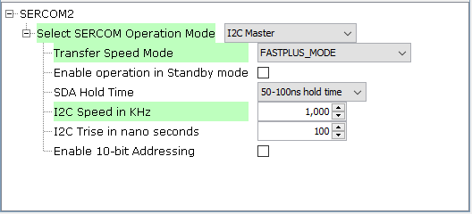

**Step 6** - In Device Resources, go to Harmony-> Tools and select STDIO, then add to the project. Select "Yes" to accept dependencies.
* Connect CONSOLE to the SERCOM0 as shown below.\
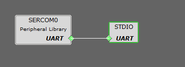

* In Configuration Options for SERCOM0, set the configuration as shown below.\
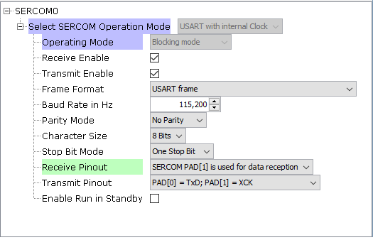

**Step 7** - In Device Resources, go to Harmony->Peripherals->EIC and select EIC, then add to the project.
- In Configuration Options for EIC, set the configuration as shown below.\
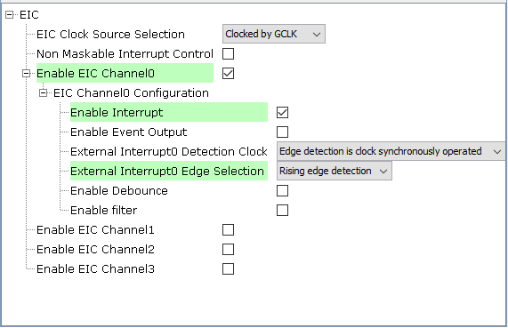

**Step 8** - Select BLE Stack in project graph. 
* To configure the device BLE Peripheral device and start advertising, configure the BLE Stack in configuration options as shown below.\
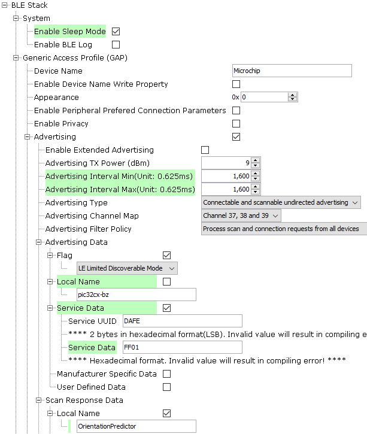

**Step 9** - Select System in project graph. 
* In Configuration Options for System, Select Device & Project Configuration -> WBZ451 Device Configuration -> Generate Fuse Settings.
* Expand DEVCFG1 and configure SERCOM0 Direct Pin Enable and SERCOM2 Direct Pin Enable as Direct Option as shown below.\
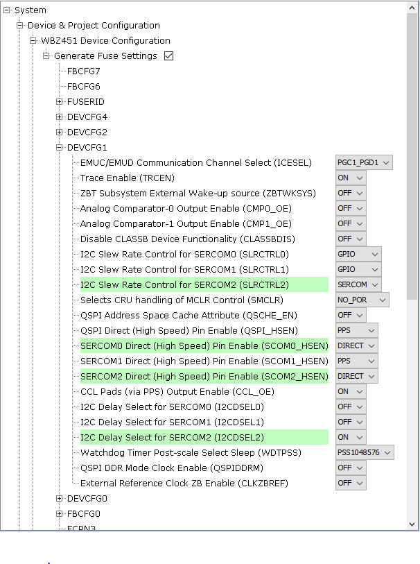

**Step 10** -  In Device Resources, go to Harmony->Third Party ->TensorFLow and select TFLite Micro, then add to the project
* In Configuration Options for TFLIte Micro, ensure the below configurations are selected.
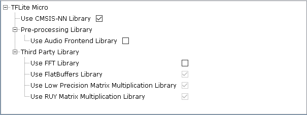

**Step 11** - [Generate](https://onlinedocs.microchip.com/pr/GUID-A5330D3A-9F51-4A26-B71D-8503A493DF9C-en-US-1/index.html?GUID-9C28F407-4879-4174-9963-2CF34161398E) the code.

**Step 12** - Place the bmi160 folder in src folder. 
- In the project explorer, Right click on folder Source Files and add a sub folder bmi160 by selecting “Add Existing Items from Folders…”\

- Click on “Add Folder…” button.

- Select the “BMI160” folder and select “Files of Types” as Source Files.
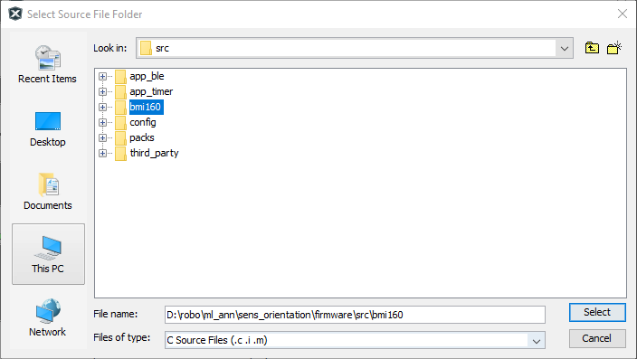
- In MPLAB Harmony v3 based application go to "firmware\src\app_user_edits.c", make sure the below code line is commented after completing the required edits.

  - "#error User action required - manually edit files as described here".

- In the project explorer, Right click on folder Source Files and add following files by selecting “Add Existing Items”
	- app_config.h
	- app_ml.cpp
	- app_ml.h
	- bmi160_sensor.c
	- constants.h
	- gesture_predictor.cpp
	- gesture_predictor.h
	- log.txt
	- model.cpp
	- model.h
	- ringbuffer.c
	- ringbuffer.h
	- sensor.h
	- sensor_config.h

- Update the app_ble_handler.c files as shown in the demo application.

	- Update BLE_GAP_EVT_CONNECTED & BLE_GAP_EVT_DISCONNECTED as shown below.
	```c
	extern uint16_t conn_hdl;
	void APP_BleGapEvtHandler(BLE_GAP_Event_T *p_event)
	{
		switch(p_event->eventId)
		{
			case BLE_GAP_EVT_CONNECTED:
			{
				USER_LED_Clear();
				conn_hdl = p_event->eventField.evtConnect.connHandle;
			}
			break;

			case BLE_GAP_EVT_DISCONNECTED:
			{
				USER_LED_Set();
				conn_hdl = 0xFFFF;
				BLE_GAP_SetAdvEnable(0x01, 0);

			}
			break;
	```
- Update the app.c and app.h files as shown in the demo application.
	- Add the following code in app.c file and update the APP_Tasks function with following code.
```c
	#define   ACC_ML_INPUT_BUFFER_SIZE  6

	APP_DATA appData;
	uint16_t conn_hdl = 0xFFFF;

	static struct sensor_device_t sensor;
	static snsr_data_t _snsr_buffer_data[SNSR_BUF_LEN][SNSR_NUM_AXES];
	static ringbuffer_t snsr_buffer;
	static volatile bool snsr_buffer_overrun = false;

	int8_t accData[ACC_ML_INPUT_BUFFER_SIZE];
	int16_t accDataBuffer[ACC_ML_INPUT_BUFFER_SIZE];
	int16_t accIndex=0;

	extern const char* labels[];

	static void SNSR_ISR_HANDLER() 
	{
		
		APP_Msg_T appMsg_BMI160_EINT;
		appMsg_BMI160_EINT.msgId = APP_MSG_BMI160_SENSOR_INT;

		OSAL_QUEUE_SendISR(&appData.appQueue, &appMsg_BMI160_EINT);

	}

	void Null_Handler() {
		// Do nothing
	}
```
- In APP_Tasks function -> APP_STATE_INIT, initialize the BLE stack, TensorFlow Lite and BMI160 sensor
```c
case APP_STATE_INIT:
        {
            bool appInitialized = true;
            //appData.appQueue = xQueueCreate( 10, sizeof(APP_Msg_T) );
            APP_BleStackInit();
            BLE_GAP_SetAdvEnable(0x01, 0);
            printf("[BLE] Started Advertising!!!\r\n");
            MIKRO_INT_CallbackRegister(Null_Handler);
            MIKRO_INT_Disable();
            
            /* Initialize the sensor data buffer */
            if (ringbuffer_init(&snsr_buffer, _snsr_buffer_data, sizeof(_snsr_buffer_data) / sizeof(_snsr_buffer_data[0]), sizeof(_snsr_buffer_data[0])))
            {        
                app_failed = 1;
            }

            /* Init and configure sensor */
            if (sensor_init(&sensor) != SNSR_STATUS_OK) {
                printf("ERROR: sensor init result = %d\n\r", sensor.status);
                app_failed = 1;
            }

            if (sensor_set_config(&sensor) != SNSR_STATUS_OK) {
                printf("ERROR: sensor configuration result = %d\n\r", sensor.status);
                app_failed = 1;
            }

            printf("sensor type is %s\n\r", SNSR_NAME);
            printf("sensor sample rate set at %dHz\n\r", SNSR_SAMPLE_RATE);
            
            #if SNSR_USE_ACCEL
                printf("Accelerometer axes %s%s%s enabled with range set at +/-%dGs\n\r", SNSR_USE_ACCEL_X ? "x" : "", SNSR_USE_ACCEL_Y ? "y" : "", SNSR_USE_ACCEL_Z ? "z" : "", SNSR_ACCEL_RANGE);
            #else
                printf("Accelerometer disabled\n\r");
            #endif

            #if SNSR_USE_GYRO
                printf("Gyrometer axes %s%s%s enabled with range set at %dDPS\n\r", SNSR_USE_GYRO_X ? "x" : "", SNSR_USE_GYRO_Y ? "y" : "", SNSR_USE_GYRO_Z ? "z" : "", SNSR_GYRO_RANGE);
            #else
                printf("Gyrometer disabled\n\r");
            #endif

            
            MIKRO_INT_Enable();
            vTaskDelay(pdMS_TO_TICKS(20)+1);
            MIKRO_INT_CallbackRegister(SNSR_ISR_HANDLER);
            tflite_setup();
            
            if (appInitialized && !app_failed)
            {
                appData.state = APP_STATE_SERVICE_TASKS;
                p_appMsg->msgId = APP_MSG_BMI160_SENSOR_READ;
                OSAL_QUEUE_Send(&appData.appQueue, p_appMsg, 0);
            }
            break;
        }
```

- In APP_Tasks function -> APP_STATE_SERVICE_TASKS, read the BMI160 sensor value as shown below.
```c
			case APP_STATE_SERVICE_TASKS:
			{
				if (OSAL_QUEUE_Receive(&appData.appQueue, &appMsg, OSAL_WAIT_FOREVER))
				{
					.
					.
					else if(p_appMsg->msgId==APP_MSG_BMI160_SENSOR_READ)
					{
						if (sensor.status != SNSR_STATUS_OK)
						{
							printf("ERROR: Got a bad sensor status: %d\n", sensor.status);
						}
						else if (snsr_buffer_overrun == true)
						{
							printf("\n\n\nOverrun!\n\n\n");
							MIKRO_INT_CallbackRegister(Null_Handler);
							ringbuffer_reset(&snsr_buffer);
							snsr_buffer_overrun = false;
							MIKRO_INT_CallbackRegister(SNSR_ISR_HANDLER);
						}
						else if(ringbuffer_get_read_items(&snsr_buffer) >= SNSR_SAMPLES_PER_PACKET)
						{
							ringbuffer_size_t rdcnt;
							SNSR_DATA_TYPE const *ptr = ringbuffer_get_read_buffer(&snsr_buffer, &rdcnt);
							while (rdcnt >= SNSR_SAMPLES_PER_PACKET) 
							{
								snsr_data_t const *scalarptr = (snsr_data_t const *) ptr;
								int x = (*scalarptr++)>>8;
								int y = (*scalarptr++)>>8;
								int z = (*scalarptr++)>>8;
								int gx = (*scalarptr++)>>8;
								int gy = (*scalarptr++)>>8;
								int gz = (*scalarptr++)>>8;
								
	#ifdef  TRAINING_MODE_ENABLED                            
								uint8_t headerbyte = MDV_START_OF_FRAME;
								int8_t tempBuff[SNSR_NUM_AXES];
								tempBuff[0] = x;
								tempBuff[1] = y;
								tempBuff[2] = z;
								tempBuff[3] = gx;
								tempBuff[4] = gy;
								tempBuff[5] = gz;
								SERCOM0_USART_Write(&headerbyte, 1);
								SERCOM0_USART_Write(tempBuff, sizeof(tempBuff));
								headerbyte = ~headerbyte;
								SERCOM0_USART_Write(&headerbyte, 1);
	#endif
								rdcnt -= SNSR_SAMPLES_PER_PACKET;
								ringbuffer_advance_read_index(&snsr_buffer, SNSR_SAMPLES_PER_PACKET);
															
								accDataBuffer[0] += x;
								accDataBuffer[1] += y;
								accDataBuffer[2] += z;
								accDataBuffer[3] += gx;
								accDataBuffer[4] += gy;
								accDataBuffer[5] += gz;

								accIndex++;

								if (accIndex >= 16) 
								{
									accData[0] = accDataBuffer[0]>>4;
									accData[1] = accDataBuffer[1]>>4;
									accData[2] = accDataBuffer[2]>>4;
									accData[3] = accDataBuffer[3]>>4;
									accData[4] = accDataBuffer[4]>>4;
									accData[5] = accDataBuffer[5]>>4;
									accIndex=0;
									p_appMsg->msgId = APP_MSG_PROCESS_TFL;
									OSAL_QUEUE_Send(&appData.appQueue, p_appMsg, 0);
									memset(accDataBuffer, 0, sizeof(accDataBuffer));
								}
							}
						}
						p_appMsg->msgId = APP_MSG_BMI160_SENSOR_READ;
						OSAL_QUEUE_Send(&appData.appQueue, p_appMsg, 0);
					}
```
- tflite_runInference() api is executed to predict the classification result from BMI160 sensor data.

```c					
					
					else if(p_appMsg->msgId==APP_MSG_PROCESS_TFL)
					{
	#ifndef  TRAINING_MODE_ENABLED 
                        tflite_runInference();
	#endif
					}
```
- The Classification result is send to MBD App using Transparent UART Service.					
```c
					else if(p_appMsg->msgId==APP_MSG_BLE_TRPS_SEND)
					{
						char temp_buff[50];
						int8_t max_index = p_appMsg->msgData[0];
						int8_t max_score = p_appMsg->msgData[1];
						uint8_t isMoving = p_appMsg->msgData[2];
						sprintf(temp_buff, "%s [%d%%] -> %s\r\n", labels[max_index], (100*max_score)/127, ((isMoving>1)?"Is Moving":"Idle"));
						if(conn_hdl != 0xFFFF)
						{
							BLE_TRSPS_SendData(conn_hdl, strlen(temp_buff), (uint8_t *)temp_buff);
						}
					}
```
## 6. Data Collection using MPLAB Data Visualizer<a name="step6">
- Ensure that MPLAB Data Visualizer is installed in MPLAB X IDE. To Install MPLAB Data Visualizer, Open MPLAB X IDE -> Tools -> Plugins.
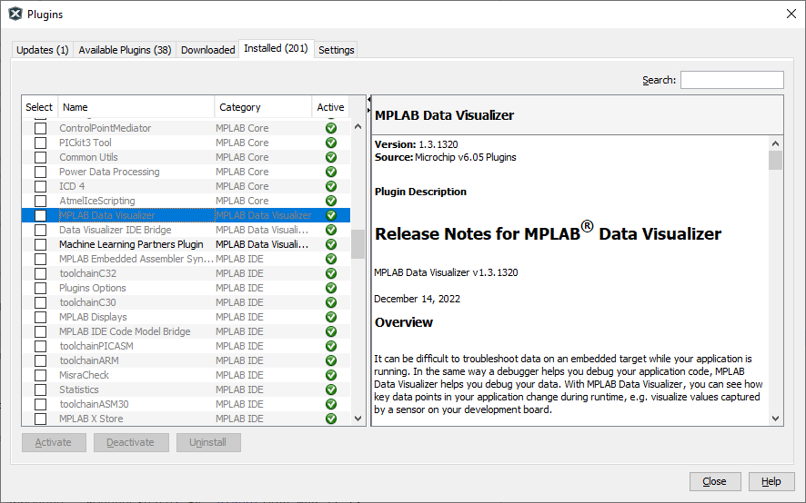

- Ensure training mode is enabled in `app_ml.h` file
```c
#define TRAINING_MODE_ENABLED
```
- Compile the project and program the board. Refer [Board Programming](#step8)

- Open MPLAB Data Visualizer by clicking the `DV` icon.
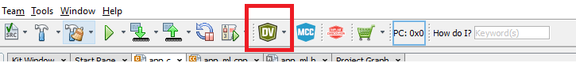

- Click on Load Workspace icon and open the workspace `BMI160_DV_workspace.dvws`
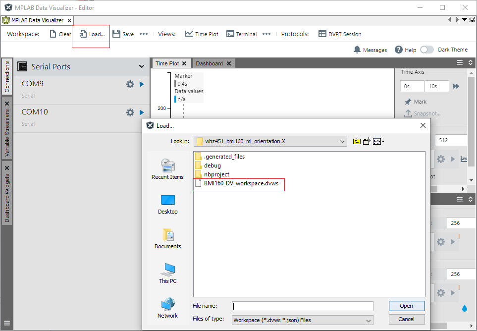

- Click on BMI160 and select the com port. Set the baudrate to 115200 as shown below.
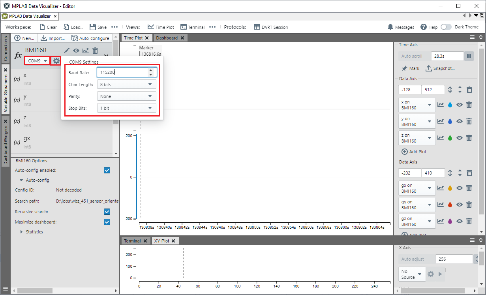

- The MPLAB Data Visualizer will begin capturing the accelerometer and gyroscope values and display them as a time plot.
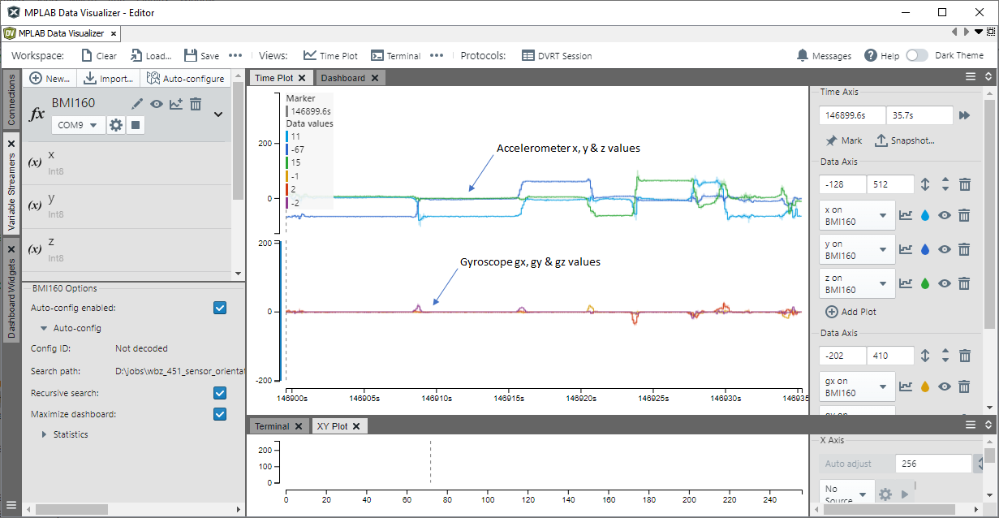

- Keep the Sensor in the Desired orientations that needs to be classified. 
- Mark the points in the timeplot that need to be captures using cursor A & Cursor B.
- Click on the Snapshot icon.
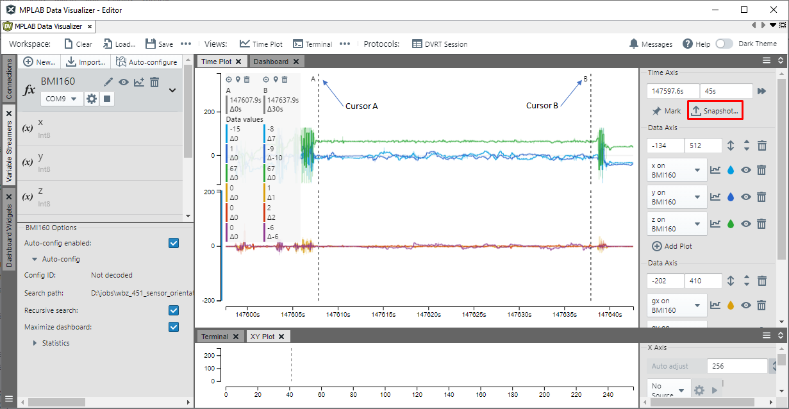

- In Sources to include, select `x`, `y`, `z`, `gx`, `gy` & `gz`. Click Next to proceed.

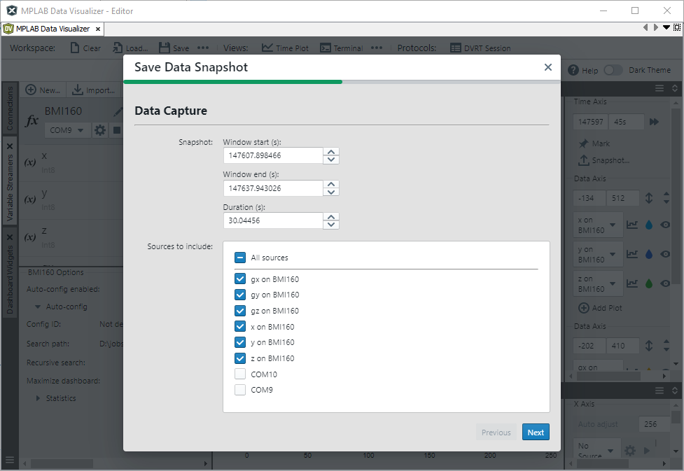

- Unselect `Include timestamps`  and allow scientific notation and click save.

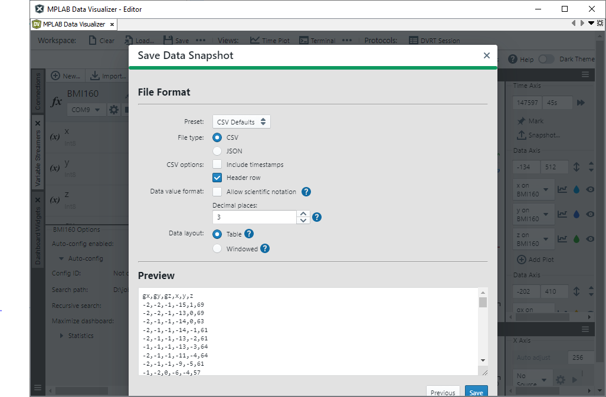

- Similarly, keep the board in different orientation, capture the sensor values and save them in csv format.

## 7. Building an Artificial Neural Network (ANN) Model with TensorFlow<a name="step7">

- The Python code that creates an Artificial Neural Network (ANN) TensorFlow model and generates the Quantized TensorFlow Lite coefficient is available in the wbz451_bmi160_ml_orientation.ipynb notebook.

- Open [wbz451_bmi160_ml_orientation.ipynb](train/wbz451_bmi160_ml_orientation.ipynb) in Google Colab or Jupyter Notebook.\
[wbz451_bmi160_ml_orientation python code](Docs/wbz451_bmi160_ml_orientation.html)

- The dataset files, which are saved in CSV format using MPLAB Data Visualizer, are mapped to a Python dictionary where the file paths serve as the values and the corresponding labels are used as keys in the dictionary.
```python
	dataset_path = {
	  'Horizontal_Down': '/content/drive/MyDrive/Colab_Notebooks/dv_dataset/Horizontal_Down.csv',
	  'Horizontal_Up': '/content/drive/MyDrive/Colab_Notebooks/dv_dataset/Horizontal_Up.csv',
	  'Side_Back':'/content/drive/MyDrive/Colab_Notebooks/dv_dataset/Side_Back.csv',
	  'Side_Front':'/content/drive/MyDrive/Colab_Notebooks/dv_dataset/Side_Front.csv',
	  'Vertical_Down':'/content/drive/MyDrive/Colab_Notebooks/dv_dataset/Vertical_Down.csv',
	  'Vertical_Up':'/content/drive/MyDrive/Colab_Notebooks/dv_dataset/Vertical_Up.csv',
	}
```
- The below code utilizes the read_csv API from the pandas library to read CSV files. It adds labels to the dataset based on the keys in dataset_path and stores the dataset in a pandas DataFrame named `df`.
```Python
	df = pd.DataFrame()
	class_end_index = []

	for i in dataset_path:
	  print(i)
	  dataframe_temp = pd.read_csv(dataset_path[i], header=0)
	  class_end_index.append(len(dataframe_temp))
	  print(dataframe_temp.info())
	  list_temp = [i for j in range(0, len(dataframe_temp))]
	  dataframe_temp['class'] = list_temp
	  frames = [df, dataframe_temp]
	  df = pd.concat(frames)
```

- The below code uses the `LabelEncoder` from `scikit-learn` to convert the class names in the dataset into numerical form. Then, it utilizes to_categorical function from the keras.utils module to convert the numerical classes into a binary class matrix representation.
- Save the accelerometer values `x`, `y`, and `z` to the pandas variable `x`, scale the value down to 128.0, and then save it as `x_scaled`. Pandas dataframe `y` holds the class values.
```Python
	df_val = df.copy()

	label_encoder = preprocessing.LabelEncoder()
	df_val['class']= label_encoder.fit_transform(df_val['class'])
	print(df_val['class'].unique())
	
	y = to_categorical(df_val['class'])
	x = df_val.drop(['class', 'gx',	'gy',	'gz'], axis =1)
	x_scaled = x /128.0
```
- Split the dataset to training and test dataset using scikit-learn api train_test_split.
```Python
	xtrain, xtest, ytrain, ytest = train_test_split(x_scaled, y, train_size = 0.75, random_state=7)
```
- Using the Keras API in TensorFlow, build an Artificial Neural Network (ANN) model with 3 hidden dense layers featuring leaky ReLU activation, a dropout layer for regularization, and a final dense layer with softmax activation, producing 6 outputs. The input layer consists of 3 inputs.
```Python
	import tensorflow as tf
	from keras import layers

	model = tf.keras.Sequential([
			layers.Dense(8, activation='LeakyReLU', input_shape = [xtrain.shape[1]]),
			layers.Dense(16, activation='LeakyReLU'),
			layers.Dropout(0.2),
			layers.Dense(8, activation='LeakyReLU'),
			layers.Dense(ytrain.shape[1], activation='softmax'),
	])

	model.summary()
```

- The `compile` function is used to compile the model, setting the loss function to categorical_crossentropy, the optimizer to Adam, and utilizing the accuracy metric for evaluating the model.
- The model is trained using the fit method with a maximum of 100 epochs, batch size 32, and the inclusion of the EarlyStopping callback for early stopping based on validation performance.
```Python
	model.compile(loss='categorical_crossentropy', optimizer='adam', metrics=['accuracy'])
	from keras.callbacks import EarlyStopping
	earlystop = EarlyStopping(monitor='val_loss', min_delta=0.0001, patience=5, verbose=1, restore_best_weights=True)

	history = model.fit(xtrain, ytrain, validation_data=(xtest, ytest), epochs = 100, batch_size = 32, callbacks=[earlystop] )
	
	model.evaluate(xtest, ytest)
```

- The function `representative_dataset` is used to generate representative data for quantization during the conversion of a TensorFlow SavedModel to a TensorFlow Lite model. It iterates over the rows of the x_scaled dataset, converts each row to a NumPy array, reshapes it to have a single batch dimension, and yields the resulting data as a list of float32 values.
- tf.lite.TFLiteConverter.from_saved_model().convert() is used to convert the saved model to a quantized TensorFlow Lite model.
```Python
	def representative_dataset():
	  val = x_scaled
	  for i in val.index:
		data = val.iloc[i].to_numpy()
		data = data.reshape(1,data.shape[0])
		yield [data.astype(np.float32)]
		
	converter = tf.lite.TFLiteConverter.from_saved_model(SAVED_MODEL_FILENAME)
	model_no_quant_tflite = converter.convert()

	# Set the optimization flag.
	converter.optimizations = [tf.lite.Optimize.DEFAULT]
	# Enforce integer only quantization
	converter.target_spec.supported_ops = [tf.lite.OpsSet.TFLITE_BUILTINS_INT8]
	converter.target_spec.supported_types = [tf.int8]
	converter.inference_input_type = tf.int8
	converter.inference_output_type = tf.int8
	# Provide a representative dataset to ensure we quantize correctly.
	converter.representative_dataset = representative_dataset
	model_tflite = converter.convert()

	# Save the model to disk
	open(QUANTIZED_TFL_MODEL_FILENAME, "wb").write(model_tflite)
```

- Install the xxd tool if it is not already available by running !apt-get update and apt-get -qq install xxd.
- Convert the quantized TensorFlow Lite model file (QUANTIZED_TFL_MODEL_FILENAME) to a C source file for TensorFlow Lite for Microcontrollers.

```Python
	# Install xxd if it is not available
	!apt-get update && apt-get -qq install xxd
	# Convert to a C source file, i.e, a TensorFlow Lite for Microcontrollers model
	!xxd -i {QUANTIZED_TFL_MODEL_FILENAME} {TFL_CC_MODEL_FILENAME}
	# Update variable names
	REPLACE_TEXT = QUANTIZED_TFL_MODEL_FILENAME.replace('/', '_').replace('.', '_')

	!sed -i 's/'{REPLACE_TEXT}'/g_model/g' {TFL_CC_MODEL_FILENAME}
	!cat '/content/drive/MyDrive/Colab_Notebooks/sensor_orientation.cc'
```

- The generated coefficient are available in the newly created file `sensor_orientation.cc`.
- Copy the generated coefficient from sensor_orientation.cc and update the file model.cpp. Update the coefficient in the array g_model and lenght of aray in g_model_len.
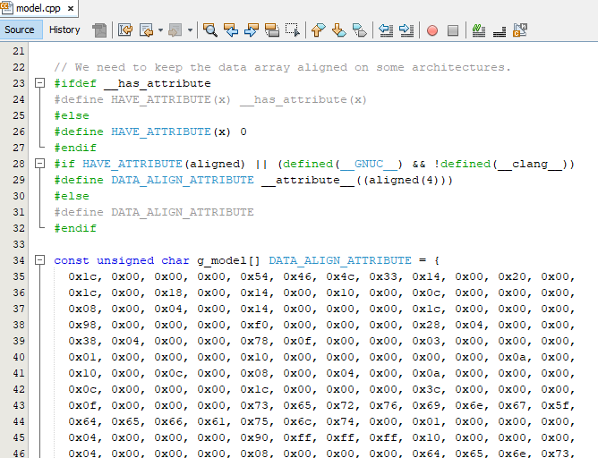
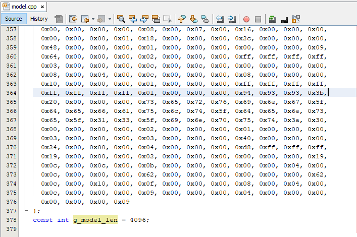

- In `app_ml.cpp` file, update INPUT_SHAPE, OUTPUT_SHAPE & labels with classification labels
```c
	#define INPUT_SHAPE     3
	#define OUTPUT_SHAPE    6

	extern int8_t accData[];
	const char* labels[OUTPUT_SHAPE] = {   
			"Horizontal_Down",			 // 0
			"Horizontal_Up",			 // 1
			"Side_Back",                 // 2
			"Side_Front",                // 3
			"Vertical_Down",			 // 4
			"Vertical_Up"			     // 5
	};
```
- In tflite_setup function, update the MicroMutableOpResolver with ops used in the TensorFlow model.
```c
    static tflite::MicroMutableOpResolver<3> micro_op_resolver;  // NOLINT
    micro_op_resolver.AddFullyConnected();
    micro_op_resolver.AddLeakyRelu();
    micro_op_resolver.AddSoftmax();
```
## 8. Board Programming<a name="step8">

### Program the precompiled hex file using MPLAB X IPE

- The application hex file can be found in the hex folder

- Follow the steps provided in the link to [program the precompiled hex file](https://microchipdeveloper.com/ipe:programming-device) using MPLABX IPE to program the pre-compiled hex image. 

### Build and program the application using MPLAB X IDE

Follow the steps provided in the link to [Build and program the application](https://github.com/Microchip-MPLAB-Harmony/wireless_apps_pic32cxbz2_wbz45/tree/master/apps/ble/advanced_applications/ble_sensor#build-and-program-the-application-guid-3d55fb8a-5995-439d-bcd6-deae7e8e78ad-section).

## 9. Run the demo<a name="step9">

- After programming the board, the expected application behavior is shown in the below.


